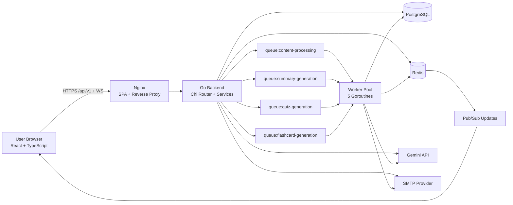

<div align="center">

# 🎓 Lectura — AI-Powered Study Operating System

### Turn lectures into **summaries, quizzes, flashcards, and progress insights** in minutes.

<p>
  
  
  
  
  
  
</p>

<p>
  <a href="#-overview">Overview</a> •
  <a href="#-live-product-tour-screenshots">Screenshots</a> •
  <a href="#-architecture">Architecture</a> •
  <a href="#-features">Features</a> •
  <a href="#-tech-stack">Tech Stack</a> •
  <a href="#-api-surface">API</a> •
  <a href="#-quick-start">Quick Start</a> •
  <a href="#-railway-deployment-guide">Railway Deploy</a> •
  <a href="#-testing--quality">Testing</a>
</p>

</div>

---

## 🚀 Overview

**Lectura** is a full-stack AI learning platform built to help students transform raw lecture content into structured study artifacts.

You can:
- paste a YouTube URL or upload files,
- generate high-quality summaries in multiple formats,
- auto-create quizzes and flashcards,
- track progress with dashboards, streaks, and study sessions,
- chat with generated summaries,
- export as PDF.

The system is designed around:
- scalable async processing workers,
- strong auth flows (JWT, refresh tokens, Google OAuth, email verification),
- production-grade deployment paths (Docker + Railway).

---

## 🖼 Live Product Tour (Screenshots)

> Screenshots are sourced from `docs/images/`.

### Authentication

<table>
<tr>
<td width="50%"><strong>Login</strong><br/></td>
<td width="50%"><strong>Register</strong><br/></td>
</tr>
</table>

### Core Workspace

<table>
<tr>
<td width="50%"><strong>Dashboard</strong><br/></td>
<td width="50%"><strong>Content Upload / Input</strong><br/></td>
</tr>
<tr>
<td width="50%"><strong>Summary Result</strong><br/></td>
<td width="50%"><strong>Quiz Experience</strong><br/></td>
</tr>
<tr>
<td width="50%"><strong>Flashcard Study</strong><br/></td>
<td width="50%"><strong>Library</strong><br/></td>
</tr>
<tr>
<td width="50%"><strong>Settings</strong><br/></td>
<td width="50%"></td>
</tr>
</table>

---

## 🧠 Architecture

### High-level flow



### Runtime internals

- API entrypoint and wiring live in `backend/cmd/server/main.go`.
- Route map is centralized in `backend/internal/router/router.go`.
- Auth routes include register/login/google/refresh/verify/resend flows.
- Worker pool consumes Redis queues and updates job progress in DB + WebSocket channels.
- Gemini service uses a bounded concurrency token-bucket strategy.

---

## ✨ Features

### 1) AI Learning Pipeline
- ✅ YouTube transcript ingestion + metadata extraction.
- ✅ File extraction for PDFs / DOCX / text.
- ✅ Summary generation with configurable:
  - format (`cornell`, `bullets`, `paragraph`, `smart`),
  - length,
  - focus areas,
  - language and audience.
- ✅ Quiz generation with multiple question types and attempt tracking.
- ✅ Flashcard deck generation with study and rating flows.

### 2) Authentication & Account Security
- ✅ Email/password registration and login.
- ✅ Email verification + resend with throttling.
- ✅ JWT access/refresh token model.
- ✅ Google OAuth with authorization-code callback flow.
- ✅ Request-level rate limiting for auth endpoints.

### 3) Productivity & Retention
- ✅ Dashboard (stats, streaks, activity, weekly goals).
- ✅ Unified Library (summaries/quizzes/flashcards).
- ✅ Favorites and quick retrieval.
- ✅ WebSocket real-time job progress.
- ✅ Summary chat assistant and PDF export.

### 4) DX + Production Readiness
- ✅ Dockerized frontend and backend.
- ✅ Railway-specific deployment configs.
- ✅ Smoke-check script for post-deploy validation.
- ✅ Test coverage for core pages and backend handlers/router.

---

## 🛠 Tech Stack

### Frontend
- React 18 + TypeScript + Vite
- Tailwind CSS + Radix UI
- React Router v6
- Vitest + Testing Library (project has 20 frontend test files)

### Backend
- Go 1.24 + Chi Router
- PostgreSQL (pgx)
- Redis (cache/session/queues/pubsub)
- Google Gemini (`gemini-2.5-flash`)
- WebSocket (gorilla/websocket)
- Python helper for PDF rendering/export

### Infrastructure
- Docker Compose for local orchestration
- Nginx for static serving + reverse proxy + TLS config
- Railway (frontend + backend + managed PostgreSQL + managed Redis)

---

## 🧩 API Surface

Base path: `/api/v1`

### Auth
- `POST /auth/register`
- `POST /auth/login`
- `GET /auth/google/config`
- `POST /auth/google`
- `POST /auth/google/code`
- `POST /auth/refresh`
- `GET /auth/verify-email`
- `POST /auth/resend-verification`
- `POST /auth/logout` (protected)

### Domain endpoints (protected unless marked)
- Content: `/content/*`
- Summaries: `/summaries/*`
- Quizzes: `/quizzes/*`, `/quiz-attempts/*`
- Flashcards: `/flashcards/*`
- Study sessions: `/study-sessions/*`
- Dashboard: `/dashboard/*`
- Library: `/library`
- User: `/user/*`
- Jobs: `/jobs/*`
- WebSocket: `/ws`

Health:
- `/health`
- `/api/v1/health`

---

## ⚡ Quick Start

### Prerequisites
- Node.js 20+
- Go 1.24+
- Docker + Docker Compose
- Gemini API key

### A) Full stack via Docker Compose

```bash
git clone https://github.com/asanaliwhy/AI-Lecture-summarizer-with-learning-activities.git
cd AI-Lecture-summarizer-with-learning-activities

# configure backend env from template
cp .env.production backend/.env
# edit backend/.env with real values

docker compose up -d --build
# frontend: https://localhost:3443 (TLS)
# backend:  http://localhost:8081/api/v1
```

### B) Local dev split mode

```bash
# terminal 1: infra only
docker compose up postgres redis -d

# terminal 2: backend
cd backend
go mod download
go run cmd/server/main.go

# terminal 3: frontend
cd ..
npm install
npm run dev
```

---

## 🚂 Railway Deployment Guide

This repository is intended to run as **4 Railway services**:
1. PostgreSQL (managed)
2. Redis (managed)
3. Backend (`backend/` root)
4. Frontend (repo root)

### Backend essentials
Set in backend Railway variables:
- `PORT=8081`
- `ENV=production`
- `DATABASE_URL`
- `REDIS_URL`
- `JWT_SECRET`
- `GEMINI_API_KEY`
- `FRONTEND_URL=https://<frontend-domain>`
- `GOOGLE_CLIENT_ID`, `GOOGLE_CLIENT_SECRET`, `GOOGLE_REDIRECT_URI`
- SMTP settings for verification emails

### Frontend essentials
Set in frontend Railway variables:
- `BACKEND_UPSTREAM=https://<backend-domain>`
- optional: `VITE_API_BASE_URL=https://<backend-domain>`

### Google OAuth values
In Google Cloud OAuth credentials:
- Authorized JS origin: `https://<frontend-domain>`
- Authorized redirect URI: `https://<frontend-domain>/auth/callback`

### Deploy order
1. Postgres + Redis
2. Backend (verify `/health`)
3. Frontend
4. Validate `/api/v1/auth/google/config`

---

## 🧪 Testing & Quality

### Frontend
```bash
npm run typecheck
npm test
npm run test:ci
npm run build
```

### Backend
```bash
cd backend
go test ./...
```

### Post-deploy smoke check
```bash
# default BASE_URL is https://localhost:3443
npm run smoke
```

---

## 📂 Project Structure

```text
.
├── backend/
│   ├── cmd/server/main.go
│   ├── internal/
│   │   ├── config/
│   │   ├── database/
│   │   ├── handlers/
│   │   ├── middleware/
│   │   ├── models/
│   │   ├── repository/
│   │   ├── router/
│   │   ├── services/
│   │   ├── websocket/
│   │   └── worker/
│   ├── migrations/
│   └── scripts/
├── src/
│   ├── components/
│   ├── hooks/
│   ├── lib/
│   ├── pages/
│   └── __tests__/
├── docs/images/
├── docker-compose.yml
├── Dockerfile
├── Dockerfile.railway
├── nginx.conf
├── nginx.ssl.conf
├── nginx.railway.conf
└── README.md
```

---

## 🔐 Security Notes

- Never commit secrets (`JWT_SECRET`, SMTP, OAuth secrets, API keys).
- Rotate any credential that was ever exposed publicly.
- Use Railway environment variables or a secrets manager.
- Keep CORS origins explicit and aligned with deployed frontend domains.

---

## 🛣 Roadmap Ideas

- Multi-language AI explanations by user locale.
- Team/classroom shared workspaces.
- Advanced spaced-repetition scheduling.
- Mobile app client (React Native).
- Observability stack (metrics dashboard + traces).

---

## 👨‍💻 Author

Built by [@asanaliwhy](https://github.com/asanaliwhy)

If this project helps you, give it a ⭐ and share it.
