<div align="center">

# 🎓 Lectura — AI-Powered Study Operating System

### Turn lectures into **summaries, quizzes, flashcards, and progress insights** in minutes.

<p>
  
  
  
  
  
  
  
</p>

<p>
  <a href="https://easygoing-vitality-production-f7c4.up.railway.app"><strong>🌐 Live Demo</strong></a> •
  <a href="#-guided-user-journey-page-by-page"><strong>🧭 Product Tour</strong></a> •
  <a href="#-flow-deep-dive-how-everything-works"><strong>🔄 End-to-End Flows</strong></a>
</p>

<p>
  <a href="#-overview">Overview</a> •
  <a href="#-guided-user-journey-page-by-page">Guided Tour</a> •
  <a href="#-flow-deep-dive-how-everything-works">Flows</a> •
  <a href="#-architecture">Architecture</a> •
  <a href="#-features">Features</a> •
  <a href="#-tech-stack">Tech Stack</a> •
  <a href="#-api-surface">API</a> •
  <a href="#-quick-start">Quick Start</a> •
  <a href="#-environment-variables-scannable-tables">Env Vars</a> •
  <a href="#-railway-deployment-guide">Railway Deploy</a> •
  <a href="#-testing--quality">Testing</a> •
  <a href="#-contributing">Contributing</a> •
  <a href="#-license">License</a>
</p>

</div>

---

## 🚀 Overview

**Lectura** is a full-stack AI learning platform built to help students transform raw lecture content into structured study artifacts.

You can:
- paste a YouTube URL or upload files,
- generate high-quality summaries in multiple formats,
- auto-create quizzes and flashcards,
- track progress with dashboards, streaks, and study sessions,
- chat with generated summaries,
- export as PDF.

The system is designed around:
- scalable async processing workers,
- strong auth flows (JWT, refresh tokens, Google OAuth, email verification),
- production-grade deployment paths (Docker + Railway).

---

## 🗺 Guided User Journey (Page-by-Page)

> All images are loaded from `docs/images/` and mapped to real product flows.

### 1) Login — Start session securely

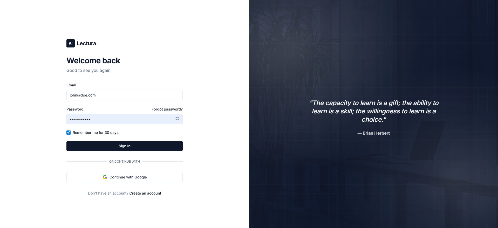

**What you do**
- Enter email/password, or choose Google sign-in.

**What happens in the system**
- Calls auth endpoints (`/auth/login` or `/auth/google/code`).
- Access + refresh tokens are issued and stored.
- App loads user profile and routes to dashboard.

**Why this matters**
- Fast onboarding with secure token lifecycle and Google OAuth fallback.

---

### 2) Register — Create account + verification flow

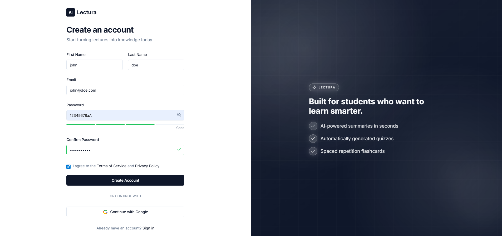

**What you do**
- Submit name, email, password.

**What happens in the system**
- Backend validates fields and creates user.
- Verification token is created in Redis.
- Verification email is sent via SMTP service.

**Why this matters**
- Prevents fake accounts, enables trust, and secures study history.

---

### 3) Content Input — Bring source material

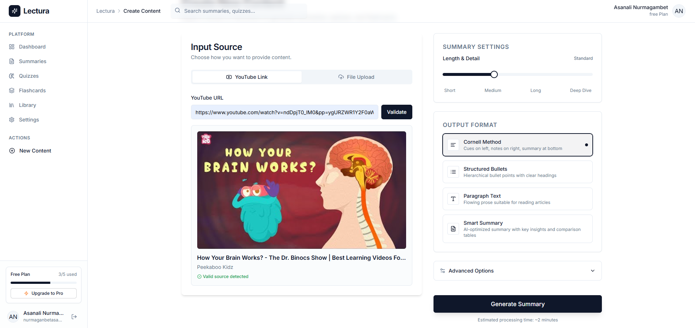

**What you do**
- Paste YouTube URL or upload document.

**What happens in the system**
- Content metadata/extraction pipeline runs.
- A processing job is pushed into Redis queues.
- Worker pool picks job and updates progress.

**Why this matters**
- Converts raw content into a normalized source for all downstream AI generation.

---

### 4) Summary Result — Your knowledge base artifact

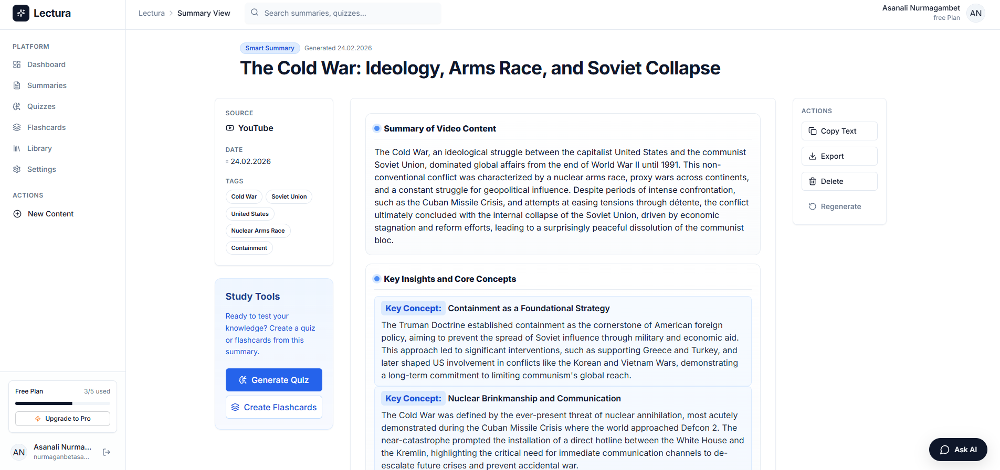

**What you do**
- Read/edit generated summary, regenerate if needed, start chat or export.

**What happens in the system**
- Gemini generates structure-aware summaries (`cornell`, `bullets`, `paragraph`, `smart`).
- Summary is persisted and becomes source for quiz/flashcards.

**Why this matters**
- Summary becomes the central node for revision, testing, and spaced learning.

---

### 5) Quiz Page — Active recall loop

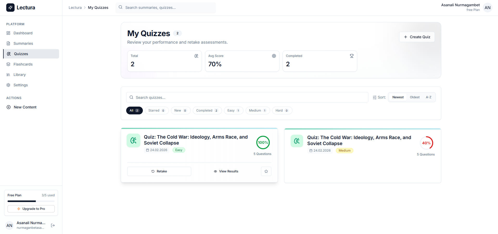

**What you do**
- Take auto-generated quizzes, submit, review results.

**What happens in the system**
- Quiz and attempts are saved with progress and scoring.
- Results feed dashboard metrics and help identify weak areas.

**Why this matters**
- Moves learning from passive reading to measurable recall.

---

### 6) Flashcard Study — Spaced repetition workflow

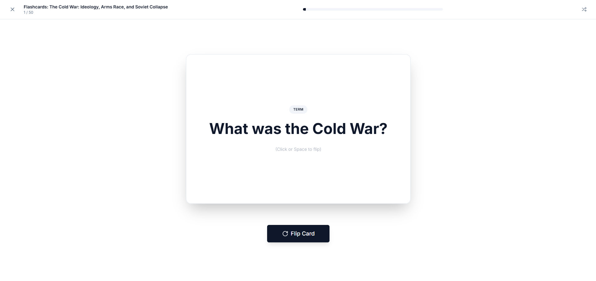

**What you do**
- Study card-by-card, rate confidence.

**What happens in the system**
- Ratings are stored to model confidence over time.
- Deck stats evolve and support long-term retention cycles.

**Why this matters**
- Builds durable memory, not short-term cramming.

---

### 7) Library — Unified knowledge inventory

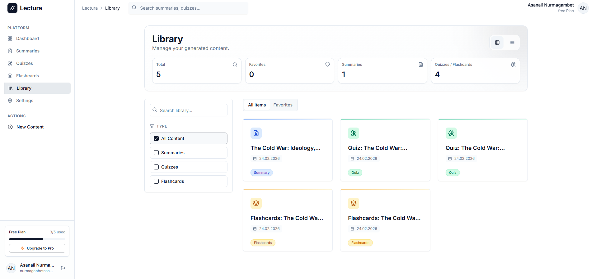

**What you do**
- Search/filter summaries, quizzes, flashcards in one place.

**What happens in the system**
- Aggregated list endpoint returns cross-content items.
- Favorites and metadata accelerate navigation.

**Why this matters**
- Keeps all learning artifacts discoverable as your content scales.

---

### 8) Dashboard + Settings — Optimization layer

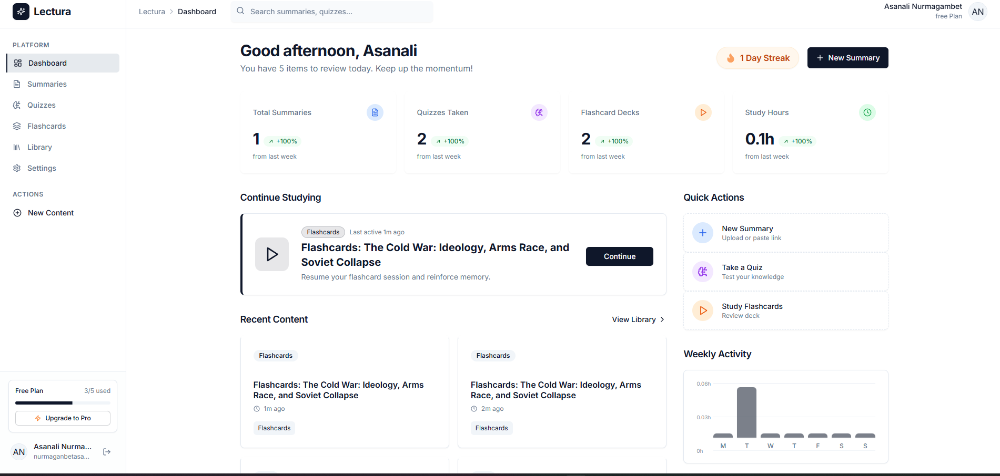

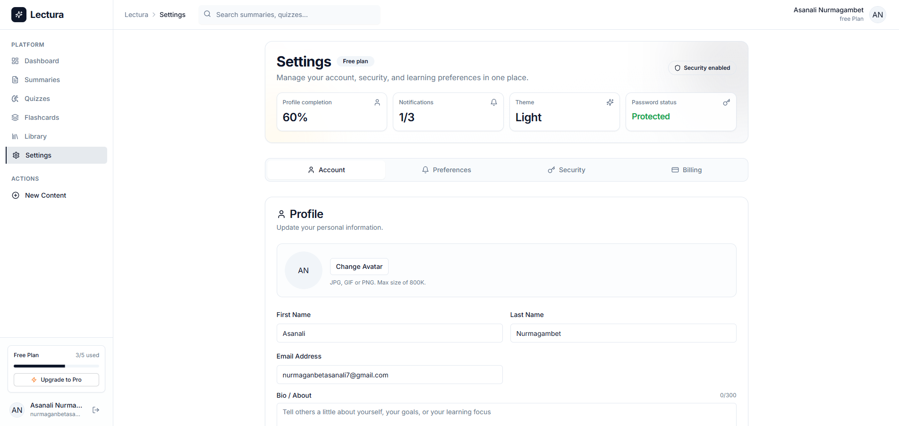

**What you do**
- Track streaks/goals/activity and configure profile/preferences.

**What happens in the system**
- Dashboard endpoints aggregate productivity signals.
- Settings endpoints persist defaults and notification preferences.

**Why this matters**
- Turns Lectura into a repeatable study system, not just a one-off generator.

---

## 🔄 Flow Deep Dive (How Everything Works)

### A) Authentication Flow (Email + Google)

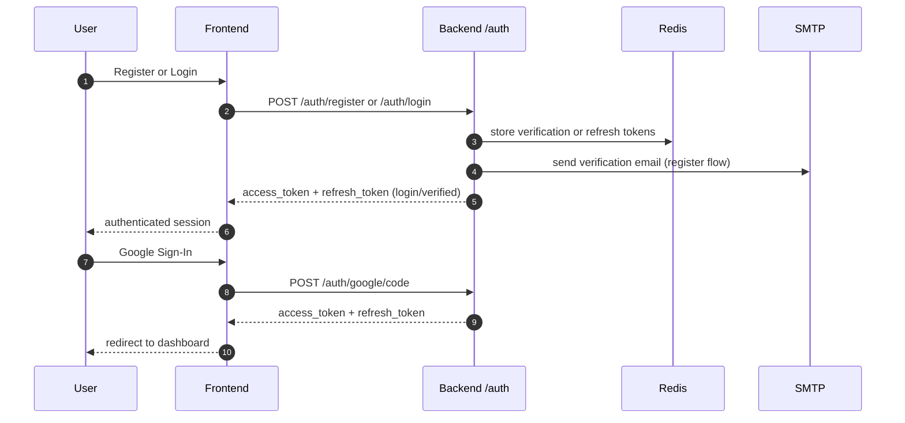

### B) Content-to-Summary Processing Flow

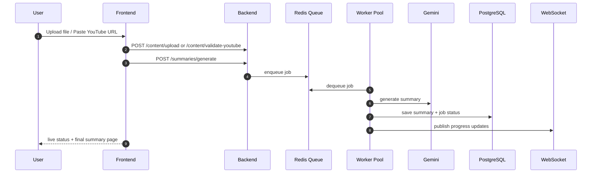

### C) Study Reinforcement Flow (Quiz + Flashcards)

1. Summary becomes input for quiz/flashcard generators.
2. User completes attempts/study sessions.
3. Scores/ratings/study-time are persisted.
4. Dashboard + streak logic use this data for feedback loops.

---

## 🧠 Architecture

### High-level flow

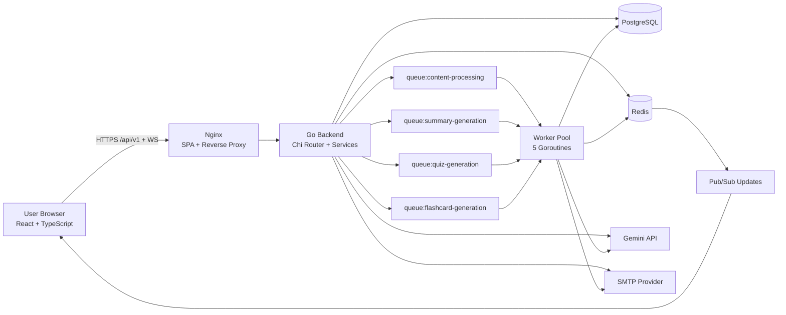

### Runtime internals

- API entrypoint and wiring live in `backend/cmd/server/main.go`.
- Route map is centralized in `backend/internal/router/router.go`.
- Auth routes include register/login/google/refresh/verify/resend flows.
- Worker pool consumes Redis queues and updates job progress in DB + WebSocket channels.
- Gemini service uses a bounded concurrency token-bucket strategy.

---

## ✨ Features

### 1) AI Learning Pipeline
- ✅ YouTube transcript ingestion + metadata extraction.
- ✅ File extraction for PDFs / DOCX / text.
- ✅ Summary generation with configurable:
  - format (`cornell`, `bullets`, `paragraph`, `smart`),
  - length,
  - focus areas,
  - language and audience.
- ✅ Quiz generation with multiple question types and attempt tracking.
- ✅ Flashcard deck generation with study and rating flows.

### 2) Authentication & Account Security
- ✅ Email/password registration and login.
- ✅ Email verification + resend with throttling.
- ✅ JWT access/refresh token model.
- ✅ Google OAuth with authorization-code callback flow.
- ✅ Request-level rate limiting for auth endpoints.

### 3) Productivity & Retention
- ✅ Dashboard (stats, streaks, activity, weekly goals).
- ✅ Unified Library (summaries/quizzes/flashcards).
- ✅ Favorites and quick retrieval.
- ✅ WebSocket real-time job progress.
- ✅ Summary chat assistant and PDF export.

### 4) DX + Production Readiness
- ✅ Dockerized frontend and backend.
- ✅ Railway-specific deployment configs.
- ✅ Smoke-check script for post-deploy validation.
- ✅ Test coverage for core pages and backend handlers/router.

---

## 🛠 Tech Stack

### Frontend
- React 18 + TypeScript + Vite
- Tailwind CSS + Radix UI
- React Router v6
- Vitest + Testing Library (project has 20 frontend test files)

### Backend
- Go 1.24 + Chi Router
- PostgreSQL (pgx)
- Redis (cache/session/queues/pubsub)
- Google Gemini (`gemini-2.5-flash`)
- WebSocket (gorilla/websocket)
- Python helper for PDF rendering/export

### Infrastructure
- Docker Compose for local orchestration
- Nginx for static serving + reverse proxy + TLS config
- Railway (frontend + backend + managed PostgreSQL + managed Redis)

---

## 🧩 API Surface

Base path: `/api/v1`

### Auth
- `POST /auth/register`
- `POST /auth/login`
- `GET /auth/google/config`
- `POST /auth/google`
- `POST /auth/google/code`
- `POST /auth/refresh`
- `GET /auth/verify-email`
- `POST /auth/resend-verification`
- `POST /auth/logout` (protected)

### Domain endpoints (protected unless marked)
- Content: `/content/*`
- Summaries: `/summaries/*`
- Quizzes: `/quizzes/*`, `/quiz-attempts/*`
- Flashcards: `/flashcards/*`
- Study sessions: `/study-sessions/*`
- Dashboard: `/dashboard/*`
- Library: `/library`
- User: `/user/*`
- Jobs: `/jobs/*`
- WebSocket: `/ws`

Health:
- `/health`
- `/api/v1/health`

---

## ⚡ Quick Start

### Prerequisites
- Node.js 20+
- Go 1.24+
- Docker + Docker Compose
- Gemini API key

### A) Full stack via Docker Compose

```bash
git clone https://github.com/asanaliwhy/AI-Lecture-summarizer-with-learning-activities.git
cd AI-Lecture-summarizer-with-learning-activities

# configure frontend + backend env from templates
cp .env.example .env
cp .env.production backend/.env
# edit backend/.env with real values

docker compose up -d --build
# frontend: https://localhost:3443 (TLS)
# backend:  http://localhost:8081/api/v1
```

### B) Local dev split mode

```bash
# terminal 1: infra only
docker compose up postgres redis -d

# terminal 2: backend
cd backend
go mod download
go run cmd/server/main.go

# terminal 3: frontend
cd ..
npm install
npm run dev
```

---

## ⚙️ Environment Variables (Scannable Tables)

### Frontend (`.env`)

> You can bootstrap from `.env.example`.

| Variable | Required | Description | Example |
|---|---|---|---|
| `VITE_API_BASE_URL` | Recommended | Backend API base URL (auto-normalized to `/api/v1`) | `http://localhost:8081/api/v1` |
| `VITE_GOOGLE_CLIENT_ID` | Optional | Google OAuth client id | `123...apps.googleusercontent.com` |
| `VITE_GOOGLE_REDIRECT_URI` | Optional | OAuth callback URL used by frontend | `http://localhost:5173/auth/callback` |

### Backend (`backend/.env`)

> You can bootstrap from `.env.production`.

| Variable | Required | Description |
|---|---|---|
| `PORT` | ✅ | Backend HTTP port (typically `8081`) |
| `ENV` | ✅ | Environment (`production` / `development`) |
| `DATABASE_URL` | ✅ | PostgreSQL connection string |
| `REDIS_URL` | ✅ | Redis connection string |
| `JWT_SECRET` | ✅ | JWT signing secret |
| `GEMINI_API_KEY` | ✅ | Google Gemini API key |
| `FRONTEND_URL` | ✅ | Allowed frontend origin(s) for CORS and links |
| `GOOGLE_CLIENT_ID` | Optional | Google OAuth client id |
| `GOOGLE_CLIENT_SECRET` | Optional | Google OAuth secret |
| `GOOGLE_REDIRECT_URI` | Optional | OAuth callback URI |
| `SMTP_HOST` / `SMTP_PORT` / `SMTP_USER` / `SMTP_PASS` / `SMTP_FROM` | Optional* | Required for production email flows |
| `STORAGE_TYPE` / `STORAGE_PATH` | Optional | Upload storage strategy/path |
| `GEMINI_REQUESTS_PER_MINUTE` | Optional | AI request rate limits |
| `GEMINI_TOKENS_PER_MINUTE` | Optional | AI token rate limits |
| `GEMINI_CONCURRENT_REQUESTS` | Optional | AI concurrency level |

---

## 🚂 Railway Deployment Guide

This repository is intended to run as **4 Railway services**:
1. PostgreSQL (managed)
2. Redis (managed)
3. Backend (`backend/` root)
4. Frontend (repo root)

### Backend essentials

| Variable | Required | Example / Notes |
|---|---|---|
| `PORT` | ✅ | `8081` |
| `ENV` | ✅ | `production` |
| `DATABASE_URL` | ✅ | Railway Postgres connection string |
| `REDIS_URL` | ✅ | Railway Redis connection string |
| `JWT_SECRET` | ✅ | Long random secret |
| `GEMINI_API_KEY` | ✅ | From Google AI Studio |
| `FRONTEND_URL` | ✅ | `https://easygoing-vitality-production-f7c4.up.railway.app` |
| `GOOGLE_CLIENT_ID` | Optional | OAuth client ID |
| `GOOGLE_CLIENT_SECRET` | Optional | OAuth client secret |
| `GOOGLE_REDIRECT_URI` | Optional | `https://<frontend-domain>/auth/callback` |
| `SMTP_*` | Optional* | Required for email verification/reset flows |

### Frontend essentials

| Variable | Required | Example / Notes |
|---|---|---|
| `BACKEND_UPSTREAM` | ✅ | `https://<backend-domain>.up.railway.app` |
| `VITE_API_BASE_URL` | Optional | Can be omitted when same-origin proxy is used |

### Google OAuth values
In Google Cloud OAuth credentials:
- Authorized JS origin: `https://<frontend-domain>`
- Authorized redirect URI: `https://<frontend-domain>/auth/callback`

### Deploy order
1. Postgres + Redis
2. Backend (verify `/health`)
3. Frontend
4. Validate `/api/v1/auth/google/config`

---

## 🧪 Testing & Quality

### Frontend
```bash
npm run typecheck
npm test
npm run test:ci
npm run build
```

### Backend
```bash
cd backend
go test ./...
```

### Post-deploy smoke check
```bash
# default BASE_URL is https://localhost:3443
npm run smoke
```

---

## 📂 Project Structure

```text
.
├── backend/
│   ├── cmd/server/main.go
│   ├── internal/
│   │   ├── config/
│   │   ├── database/
│   │   ├── handlers/
│   │   ├── middleware/
│   │   ├── models/
│   │   ├── repository/
│   │   ├── router/
│   │   ├── services/
│   │   ├── websocket/
│   │   └── worker/
│   ├── migrations/
│   └── scripts/
├── src/
│   ├── components/
│   ├── hooks/
│   ├── lib/
│   ├── pages/
│   └── __tests__/
├── docs/images/
├── docker-compose.yml
├── Dockerfile
├── Dockerfile.railway
├── nginx.conf
├── nginx.ssl.conf
├── nginx.railway.conf
└── README.md
```

---

## 🔐 Security Notes

- Never commit secrets (`JWT_SECRET`, SMTP, OAuth secrets, API keys).
- Rotate any credential that was ever exposed publicly.
- Use Railway environment variables or a secrets manager.
- Keep CORS origins explicit and aligned with deployed frontend domains.

---

## 🛣 Roadmap Ideas

- [ ] Multi-language AI explanations by user locale.
- [ ] Team/classroom shared workspaces.
- [ ] Advanced spaced-repetition scheduling.
- [ ] Mobile app client (React Native).
- [ ] Observability stack (metrics dashboard + traces).

---

## 🤝 Contributing

Contributions are welcome.

Please read [CONTRIBUTING.md](CONTRIBUTING.md) for:
- local setup,
- branch/commit conventions,
- pull request checklist.

For major feature work, open an issue first to align scope.

---

## 📜 License

This project is licensed under the MIT License.

See [LICENSE](LICENSE).

---

## 👨‍💻 Author

Built by [@asanaliwhy](https://github.com/asanaliwhy)

If this project helps you, give it a ⭐ and share it.
