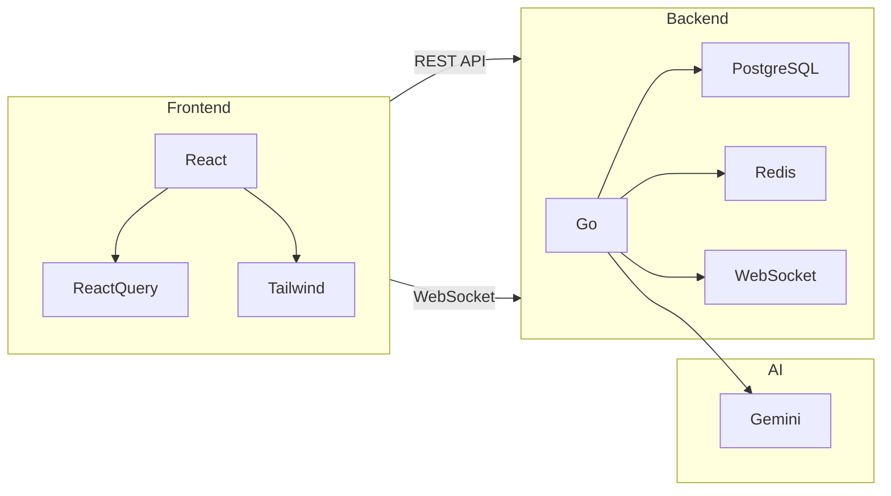
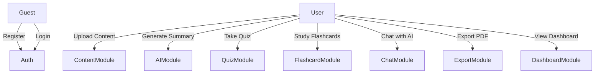
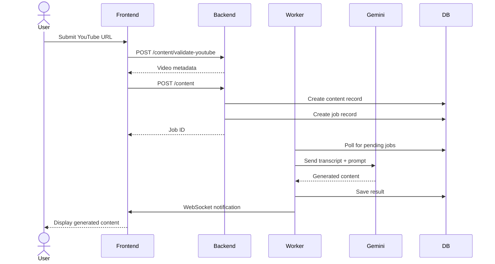
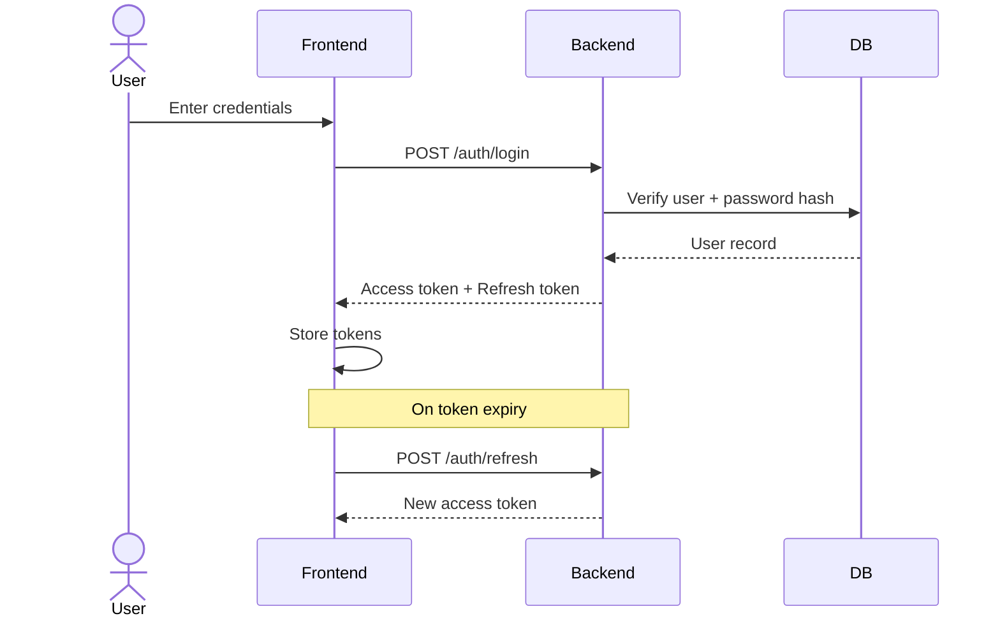
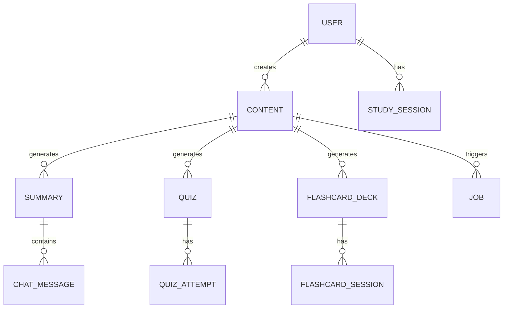

  

    
Ministry of Science and Higher Education

    
of the Republic of Kazakhstan

    
Astana IT University

    
Faculty of Information Technologies

    
Department of Software Engineering

  

  
Bachelor Diploma Thesis

  
Lectura — AI-Powered Study Assistant

  
Design and implementation of an AI-powered web application for transforming lectures and documents into structured study materials

  

    <table class="cover-grid">
      <tr><td>Students</td><td>Nurmagambet Asanali Bayadilov Asanali</td></tr>
      <tr><td>Course</td><td>3</td></tr>
      <tr><td>Specialty</td><td>6B06103 — Software Engineering</td></tr>
      <tr><td>Supervisor</td><td>[Supervisor Full Name] [Title, Degree]</td></tr>
      <tr><td>Academic Year</td><td>2025–2026</td></tr>
    </table>
  

  

    Prepared at <strong>Astana IT University</strong>
    Astana, 2026
  

ABSTRACT

(English)

Lectura is an AI-powered study assistant designed to transform long-form educational content into structured and interactive learning materials. The system addresses a recurring challenge in modern higher education: students are frequently required to process large volumes of lecture videos, presentation recordings, academic texts, and supporting documentation, yet they often lack sufficient time and efficient tools for extracting the most important concepts, retaining information, and preparing for assessment. The project proposes a web-based platform that accepts YouTube lecture videos, uploaded documents, plain text, and audio-derived textual content, and converts them into organized study outputs such as summaries, quizzes, flashcards, and conversational tutoring sessions.

The application is implemented as a full-stack web system using React 18, TypeScript, Tailwind CSS, and React Query on the frontend, and Go, PostgreSQL, Redis, and WebSockets on the backend. Artificial intelligence functionality is powered by Google Gemini 3 Flash preview, which is used for summary generation, question generation, flashcard creation, and context-aware educational dialogue. The platform also incorporates JWT-based authentication, refresh token rotation, Google OAuth, PDF export, dashboard analytics, a library of saved learning materials, and study session tracking.

This thesis presents the background, design rationale, methodological approach, and architectural decisions behind Lectura. It examines relevant literature in artificial intelligence for education, summarization, quiz generation, conversational tutoring, and spaced repetition. It also compares existing systems and justifies the need for a specialized solution that unifies multimodal input processing and structured learning support in a single platform. The document further describes data collection and preprocessing, API and security methodology, core UML and architecture models, technology selection, and interface mockups. The resulting project demonstrates how modern AI systems can be combined with robust web engineering practices to support more accessible, efficient, and personalized study workflows.

<strong>Keywords:</strong> artificial intelligence in education, educational technology, summarization, flashcards, spaced repetition, quiz generation, conversational AI, web application, YouTube transcript processing

ABSTRACT

(Қазақша)

Lectura — бұл ұзақ формадағы білім беру мазмұнын құрылымдалған және интерактивті оқу материалдарына айналдыруға арналған жасанды интеллект негізіндегі оқу көмекшісі. Жүйе заманауи жоғары білім берудегі қайталанатын мәселені шешеді: студенттерден лекциялық бейнелерді, презентация жазбаларын, академиялық мәтіндерді және негіздемелік құжаттаманы үлкен көлемде өңдеу жиі талап етіледі, бірақ оларда маңызды түсініктерді шығарып алу, ақпаратты сақтау және бағалауға дайындалу үшін жеткілікті уақыт пен тиімді құралдар жетіспейді. Жоба YouTube лекциялық бейнелерін, жүктелген құжаттарды, қарапайым мәтінді және аудиодан алынған мәтіндік мазмұнды қабылдайтын және оларды конспектілер, тесттер, флэш-карталар және чат-репетитор сессиялары сияқты ұйымдастырылған оқу нәтижелеріне айналдыратын веб-платформаны ұсынады.

Қосымша фронтендте React 18, TypeScript, Tailwind CSS және React Query, ал бакендте Go, PostgreSQL, Redis және WebSocket қолданатын толық стек веб-жүйе ретінде іске асырылған. Жасанды интеллект функциялары Google Gemini 3 Flash preview арқылы жұмыс істейді, ол конспектілерді генерациялау, сұрақтар құрастыру, флэш-карталар жасау және контекстік білім беру диалогына арналған. Сондай-ақ платформаға JWT негізіндегі аутентификация, рефреш-токен ротациясы, Google OAuth, PDF-ке экспорттау, бақылау тақтасы аналитикасы, сақталған оқу материалдарының кітапханасы және оқу сессияларын бақылау кіреді.

Бұл дипломдық жұмыста Lectura-ның негізі, жобалау негіздемесі, әдіснамалық тәсілі және архитектуралық шешімдері ұсынылған. Онда білім берудегі жасанды интеллект, конспектілеу, тест генерациясы, чат-репетиторлық және интервалды қайталау бойынша тиісті әдебиеттер қарастырылады. Сондай-ақ қолданыстағы жүйелерге салыстырмалы талдау жасалып, мультимодальды енгізуді өңдеу мен құрылымдық оқуды қолдауды бір платформада біріктіретін арнайы шешімнің қажеттілігі негізделеді. Құжат деректерді жинау мен алдын ала өңдеуді, API және қауіпсіздік әдіснамасын, логикалық UML және архитектуралық модельдерді, технологияларды таңдауды және интерфейс макеттерін сипаттайды. Нәтижелі жоба заманауи ЖИ жүйелерінің қолжетімді, тиімді және жекелендірілген оқу процестерін қолдау үшін сенімді веб-инжиниринг тәжірибелерімен қалай біріктірілетінін көрсетеді.

<strong>Keywords:</strong> білім берудегі жасанды интеллект, білім беру технологиялары, конспектілеу, флэш-карталар, интервалды қайталау, тест генерациясы, чат-ЖИ, веб-қосымша, YouTube транскрипттерін өңдеу

ABSTRACT

(Русский)

Lectura — это учебный ассистент на базе искусственного интеллекта, предназначенный для преобразования образовательного контента в структурированные и интерактивные учебные материалы. Система решает актуальную проблему современного высшего образования: от студентов часто требуется изучение больших объемов видеолекций, записей презентаций, академических текстов и сопутствующей документации, однако им зачастую не хватает времени и эффективных инструментов для извлечения ключевых концепций, запоминания информации и подготовки к аттестации. Проект предлагает веб-платформу, которая принимает видеолекции YouTube, загруженные документы, обычный текст и текстовый контент, полученный из аудио, и преобразует их в организованные учебные материалы, такие как конспекты, тесты, флэш-карточки и сессии с ИИ-репетитором.

Приложение реализовано как полностековая веб-система с использованием React 18, TypeScript, Tailwind CSS и React Query на фронтенде, и Go, PostgreSQL, Redis и WebSockets на бэкенде. Функциональность искусственного интеллекта обеспечивается моделью Google Gemini 3 Flash preview, которая используется для генерации конспектов, формирования вопросов, создания флэш-карточек и контекстного образовательного диалога. Платформа также включает аутентификацию на базе JWT, ротацию токенов обновления, Google OAuth, экспорт в PDF, аналитику на панели управления, библиотеку сохраненных учебных материалов и отслеживание учебных сессий.

В данной дипломной работе представлены предыстория, обоснование дизайна, методологический подход и архитектурные решения Lectura. Рассматривается соответствующая литература по искусственному интеллекту в образовании, суммаризации, генерации тестов, диалоговому обучению и интервальным повторениям. Также проводится сравнение существующих систем и обосновывается необходимость специализированного решения, объединяющего мультимодальную обработку входных данных и структурированную поддержку обучения на единой платформе. В документе далее описываются сбор и предварительная обработка данных, методология API и безопасности, основные модели UML и архитектуры, выбор технологий и макеты интерфейса. Полученный проект демонстрирует, как современные системы ИИ могут быть объединены с надежными практиками веб-инжиниринга для поддержки более доступных, эффективных и персонализированных учебных процессов.

<strong>Keywords:</strong> искусственный интеллект в образовании, образовательные технологии, суммаризация, флэш-карточки, интервальные повторения, генерация тестов, чат-ИИ, веб-приложение, обработка транскриптов YouTube

TABLE OF CONTENTS

<ul class="toc-list">
  <li>Abstract2</li>
  <li>Abstract (Kazakh)3</li>
  <li>Abstract (Russian)4</li>
  <li>1. Introduction5</li>
  <li class="toc-level-2">1.1 Background and Motivation5</li>
  <li class="toc-level-2">1.2 Problem Statement6</li>
  <li class="toc-level-2">1.3 Objectives of the Project7</li>
  <li class="toc-level-2">1.4 Scope and Limitations7</li>
  <li class="toc-level-2">1.5 Structure of the Thesis8</li>
  <li>2. Literature Review9</li>
  <li class="toc-level-2">2.1 Artificial Intelligence in Education9</li>
  <li class="toc-level-2">2.2 Large Language Models in Education10</li>
  <li class="toc-level-2">2.3 Automatic Summarization Techniques11</li>
  <li class="toc-level-2">2.4 Cognitive Science of Active Recall and Spaced Repetition12</li>
  <li class="toc-level-2">2.5 Automatic Question Generation from Text13</li>
  <li class="toc-level-2">2.6 Conversational AI Tutors in Education14</li>
  <li class="toc-level-2">2.7 Summary of Literature Review15</li>
  <li>3. Analysis of Existing Systems16</li>
  <li>4. Data Collection22</li>
  <li>5. Methodology27</li>
  <li>6. System Architecture and UML Design33</li>
  <li>7. Technology Comparison41</li>
  <li>8. Results and Discussion47</li>
  <li>9. References51</li>
</ul>

# 1. Introduction

## 1.1. Background and Motivation

The rapid growth of digital education has significantly changed the way students access and consume knowledge. University learners increasingly rely on recorded lectures, online tutorials, digital course packs, scanned readings, and educational platforms that provide content in asynchronous formats. This shift has many advantages, including flexibility, broader access to expertise, and the ability to revisit complex topics. However, it also introduces a major practical challenge: students are now expected to process a much larger quantity of information without always receiving additional support for organizing and retaining it.

In traditional classroom settings, students often complement live lectures with handwritten notes, interaction with instructors, and peer discussion. In contrast, online and hybrid learning environments frequently require the learner to independently extract key ideas from videos and documents that may last for hours or contain dense technical explanations. Many students respond to this challenge by watching content multiple times, manually pausing to take notes, or copying fragments of material into separate applications. These activities are time-consuming and cognitively demanding. As a result, the learning process can become inefficient, particularly when students are under pressure to prepare for examinations or complete assignments within limited time.

At the same time, recent progress in artificial intelligence, natural language processing, and large language models has created new possibilities for educational support systems. Modern AI services are capable of analyzing textual input, identifying central ideas, rewriting information in clearer formats, producing practice questions, generating memory aids, and supporting user interaction through conversational interfaces. These capabilities are especially relevant to education because they can reduce the burden of repetitive cognitive tasks and help learners focus on understanding and application rather than mere extraction of raw information.

The importance of AI-powered study tools lies not only in automation, but also in personalization and accessibility. Students have different learning preferences: some understand best through concise bullet summaries, others through paragraph explanations, question-answer structures, or spaced repetition. An intelligent study assistant can adapt content into multiple learning formats and thereby support a wider range of learning styles. In addition, such tools can benefit non-native speakers, students with attention difficulties, and users who require structured materials from otherwise unstructured educational content.

The project presented in this thesis, Lectura, emerges from this educational and technological context. It is designed as an integrated platform that converts YouTube lectures and uploaded documents into study-ready outputs such as summaries, quizzes, flashcards, and AI-assisted chat conversations. The motivation behind Lectura is the recognition that students do not merely need information access; they need mechanisms for transformation, organization, practice, and retention.

## 1.2. Problem Statement

The central problem addressed in this thesis is the difficulty students face when attempting to extract meaningful, structured, and memorable knowledge from long lecture videos and textual documents. This difficulty manifests in several related forms.

First, educational input sources are often long, noisy, and unstructured. A lecture video may include introductions, repetitions, examples, informal speech, and irrelevant discussion mixed with important conceptual content. Similarly, PDF documents may contain headers, footers, formatting artifacts, or pages with dense text that are difficult to review efficiently. Students must therefore spend considerable effort identifying what is essential.

Second, conventional note-taking and review methods are labor-intensive. Although note-taking itself can support learning, the manual creation of complete summaries, flashcards, and self-assessment questions requires substantial time. When students are managing multiple courses simultaneously, the repeated effort needed to transform content into active study materials becomes a barrier to consistent revision.

Third, many existing platforms address only one part of the learning workflow. Some tools are good for note organization, others for flashcards, others for conversational assistance, and others for course delivery. Few systems combine multimodal content ingestion, summary generation, self-testing, memorization support, progress tracking, and export functionality in a unified environment tailored to independent study.

Fourth, general-purpose AI chat systems can generate content on demand, but they often require users to manually paste source text, refine prompts, and verify structure and consistency. For students, this introduces prompt-engineering overhead and reduces reliability. There is a need for a system that embeds AI capability into a controlled and repeatable workflow.

The problem can therefore be summarized as follows: students lack an integrated tool that can automatically convert raw educational content into structured, reusable, and interactive learning materials while preserving usability, efficiency, and academic relevance.

## 1.3. Objectives of the Project

The main objective of Lectura is to design and implement an AI-powered web application that helps students transform educational content into structured study materials. This main objective can be divided into several specific goals:

1. To support multiple input modalities, including YouTube lecture videos, uploaded PDF documents, plain text, and text derived from audio-related sources.
2. To extract and preprocess textual content from these inputs in a reliable manner suitable for downstream AI processing.
3. To generate summaries in multiple pedagogically useful formats, namely Cornell notes, bullet summaries, paragraph summaries, and smart structured summaries.
4. To automatically generate quizzes containing multiple-choice questions from the processed source material.
5. To generate flashcard decks suitable for repeated study and integration with spaced repetition workflows.
6. To provide an AI chat assistant linked to generated summaries so that learners can ask follow-up questions grounded in the study material.
7. To track user study activity, including quiz attempts, flashcard sessions, and overall learning statistics.
8. To enable export of generated materials into PDF format for offline use and long-term archiving.
9. To build the application using modern, scalable web technologies that support maintainability, responsive design, and efficient deployment.
10. To provide a secure user experience through authentication, session management, and privacy-aware data handling.

These objectives reflect both educational and engineering priorities. From an educational standpoint, the project seeks to improve learning efficiency, comprehension, and retention. From a software engineering standpoint, it aims to deliver a robust full-stack system capable of integrating AI services into a coherent user workflow.

## 1.4. Scope and Limitations

The scope of the Lectura project includes the design and implementation of a production-style web application with integrated AI services. The project covers frontend and backend development, database design, worker-based asynchronous job processing, real-time job status notifications, user authentication, content generation workflows, analytics, and document export.

Within this scope, the system focuses primarily on post-processing of already available educational material. In other words, Lectura does not replace content creation, teaching, or formal assessment by instructors. Instead, it acts as a support tool that helps students convert source material into more usable study resources.

The project includes the following functional scope:

- ingestion of YouTube URLs and uploaded documents;
- transcript and text extraction;
- AI-generated summaries, quizzes, flashcards, and chat responses;
- user account management and OAuth support;
- dashboards and libraries for saved materials;
- export of generated content into PDF;
- monitoring of study interactions and history.

Despite its broad functionality, the project has several limitations.

First, AI-generated output is probabilistic rather than deterministic. Although prompts and validation logic can improve consistency, summaries and questions may still vary in quality or occasionally contain inaccuracies. Human review remains necessary, especially for high-stakes study contexts.

Second, the quality of output depends heavily on input quality. Poorly transcribed videos, scanned PDFs with extraction errors, incomplete captions, or ambiguous source material may reduce the accuracy of generated content.

Third, the system is oriented toward English-language academic content and may not perform equally well for all domains, languages, or document structures.

Fourth, the current implementation is a web application, which means that offline-native operation and deep device-level integrations available in desktop or mobile applications are outside the present scope.

Fifth, while study tracking and analytics are included, Lectura is not intended to be a full learning management system. It does not provide teacher dashboards, course administration, grading pipelines, or institutional reporting.

## 1.5. Structure of the Thesis

This thesis is organized into eight main chapters in addition to the abstract and references.

Chapter 1 introduces the educational context, motivation, problem statement, project objectives, and scope. It establishes the need for a system such as Lectura.

Chapter 2 reviews relevant academic literature on artificial intelligence in education, summarization, spaced repetition, quiz generation, and conversational tutoring systems. This chapter provides the theoretical foundation for the project.

Chapter 3 analyzes existing systems including Notion AI, Quizlet, Anki, ChatGPT, and Coursera. The purpose of this chapter is to identify current strengths and gaps in available solutions and to position Lectura within the broader EdTech landscape.

Chapter 4 describes the types of data processed by the system, the extraction methods used for YouTube and document inputs, preprocessing steps, storage of user study data, and privacy considerations.

Chapter 5 explains the methodology used in the project, including system design decisions, agile development, prompt engineering, API design, testing practices, and security strategy.

Chapter 6 presents the minimum viable product definition, architecture, and UML-style diagram descriptions. It explains how the system is organized across frontend, backend, database, AI, and worker infrastructure.

Chapter 7 compares the selected technologies with relevant alternatives and justifies the final technical stack.

Chapter 8 describes the project mockups and interface design, outlining the purpose and interaction logic of the key screens.

Finally, the reference section lists the academic and technical sources that inform the thesis.

---

# 2. Literature Review

## 2.1. Artificial Intelligence in Education

Artificial intelligence in education (AIEd) has evolved from rule-based tutoring systems toward data-driven and language-based systems capable of adaptation, feedback generation, and personalized support. Early intelligent tutoring systems (ITS) were designed to model expert knowledge and student understanding in constrained domains, often using symbolic reasoning and pre-authored pedagogical rules. These systems demonstrated that personalized guidance could improve learning outcomes, but they were difficult to scale because each subject domain required significant manual modeling. Holmes et al. [1] argued that AI can support education through personalization, teacher augmentation, and learning analytics, provided that ethical and pedagogical constraints are considered carefully. This transition from narrow expert systems to flexible, data-driven architectures marks a shift toward more scalable educational support.

The integration of machine learning into AIEd has allowed for more nuanced modeling of student behavior and knowledge states. Luckin and Cukurova [2] emphasized that AI should be understood not as a replacement for teachers but as a tool that can enhance human decision-making and learner support. They highlight that the design of AIEd tools must be grounded in learning sciences to be truly effective. In a similar way, Holmes et al. [1] argue that data-informed personalization and feedback can strengthen learner support when such systems remain ethically and pedagogically constrained. This systemic view of AI as an augmentation layer is central to the design philosophy of Lectura.

One of the most important developments in this field is the rise of large language models (LLMs). These models are capable of generating coherent text, transforming input into structured representations, and simulating tutoring dialogue. Kasneci et al. [11] note that LLMs like GPT-4 and Gemini can significantly lower the barrier to creating high-quality educational content. However, they also caution about the risks of hallucinations and the need for rigorous validation of AI-generated materials. The application of LLMs in education requires a careful balance between leveraging generative power and ensuring academic integrity and accuracy.

## 2.2. Large Language Models in Education

The emergence of Large Language Models (LLMs) has fundamentally altered the landscape of educational technology. Contemporary generative models demonstrate powerful capabilities in natural language understanding, explanation, summarization, and dialogue. In the educational context, Kasneci et al. [11] note that such systems can lower the barrier to creating adaptive explanations, study materials, and tutoring-style interactions, provided that accuracy and oversight remain central concerns.

Modern LLM-based systems are especially relevant to study assistants because they can process long textual inputs and produce outputs in several pedagogical forms, including summaries, guided explanations, and self-assessment questions. As discussed by Kasneci et al. [11], these capabilities are promising for tutoring and support scenarios, but only when responses remain grounded and are interpreted critically by learners. In Lectura, Gemini 3 Flash is used in this applied role: it processes long-form transcripts and converts them into pedagogical structures such as Cornell notes, structured summaries, and quizzes.

The practical use of LLMs in EdTech also depends on careful prompt design. Structured prompts, output constraints, and context grounding can improve consistency and reduce irrelevant or weakly supported output. From an educational perspective, this matters because the value of AI generation does not come only from fluency, but from alignment with learning goals and source material [1], [2], [11].

## 2.3. Automatic Summarization Techniques

Automatic summarization (AS) is a long-standing research area within natural language processing (NLP). The goal of AS is to reduce the length of source material while preserving its central meaning. Two major approaches dominate the literature: extractive and abstractive summarization. Extractive summarization selects existing sentences or phrases from a source document. Mihalcea and Tarau [3] introduced TextRank, which uses graph centrality to rank sentence importance, providing a reliable unsupervised baseline. While extractive methods are factual, they often lack the coherence required for high-quality study notes.

Abstractive summarization, by contrast, generates new phrasing that captures the meaning of the original material. This approach is more aligned with how humans typically write summaries. Research by See et al. [4] demonstrated how neural sequence-to-sequence models with copy mechanisms could improve factual grounding while retaining generative flexibility. Subsequent progress in neural and transformer-based NLP has further improved coherence and usability in practical summarization systems. Mani [5] highlighted that summary quality depends not only on information coverage but also on user purpose, which is why Lectura offers multiple categorical formats.

In an educational context, summarization must prioritize key definitions, procedures, and conceptual relationships over mere text reduction. For instance, the Cornell Note-taking system is designed to facilitate active review. Creating such structured notes automatically requires an abstractive model that can categorize information into "Cues," "Notes," and "Summary" sections. This requires deep semantic understanding, which modern LLMs provide through their extensive pre-training on diverse textual corpora.

## 2.4. Cognitive Science of Active Recall and Spaced Repetition

The effectiveness of study tools like flashcards and quizzes is deeply rooted in cognitive psychology, specifically the principles of active recall and spaced repetition. Retrieval practice—the act of bringing information to mind—strengthens neural pathways and makes memory more durable. Roediger and Karpicke [8] demonstrated that students who were tested on material after reading it performed significantly better on long-term retention tests than those who merely re-read the material.

Spaced repetition exploits the "spacing effect," where reviews are scheduled at increasing intervals to combat the "forgetting curve" first described by Ebbinghaus in 1885 [6]. Ebbinghaus showed that memory decays exponentially unless reinforced. Later research on distributed practice and retrieval confirms that effortful recall and appropriately spaced review improve durable learning [7], [8]. By scheduling reviews just before the information is likely to be forgotten, spaced repetition systems (SRS) maximize efficiency and retention.

Cepeda et al. [7] conducted a comprehensive study on distributed practice, finding that the optimal gap between study sessions depends on the desired retention period. In Lectura, flashcard study sessions are designed to facilitate this active recall. By generating atomic, testable question-answer pairs from source content, the system reduces the "friction" of manual card creation, allowing students to move directly into the reinforcement phase. This integration of cognitive science into automated workflows is a central value proposition of the project.

## 2.5. Automatic Question Generation from Text

Automated question generation (AQG) has received increasing attention as NLP systems have improved. The educational appeal of AQG lies in its ability to support formative assessment. Early approaches to AQG were largely rule-based, using syntactic parsing and templates to transform sentences into questions. While reliable, these systems often produced grammatically awkward or overly simple questions. Kurdi et al. [9] reviewed these developments, noting the progression from rule-based to deep learning approaches.

The shift toward transformer-based models has revolutionized AQG by allowing for "answer-aware" and "context-aware" generation. Instead of just relying on syntax, modern models understand the semantic importance of different parts of a text. For example, a system can identify a key concept and generate a multiple-choice question (MCQ) that tests the student's understanding of that concept's relationship to others. This requires not only generating a valid question stem but also creating "plausible distractors"—incorrect options that represent common misconceptions.

Generating high-quality distractors is one of the hardest parts of AQG. As noted in the broader review by Kurdi et al. [9], question quality depends not only on grammatical correctness but also on the pedagogical usefulness of answer options. In Lectura, the Gemini API is prompted to generate MCQs with distractors that are semantically related to the correct answer but factually incorrect in the given context. This ensures that the quizzes are not trivial and provide meaningful self-assessment for the student.

## 2.6. Conversational AI Tutors in Education

Conversational AI systems allow students to engage in dialogue, ask clarifying questions, and receive immediate responses. Traditional intelligent tutoring systems (ITS) were effective but resource-intensive to build. Current LLM-based tutors, such as those discussed by Winkler and Söllner [10], offer a scalable supplement. These systems can emulate Socratic dialogue, guiding students through reasoning steps rather than just providing answers.

Socratic tutoring involves asking questions that lead the learner to discover the answer themselves. Research by D’Mello and Graesser [14] on systems like AutoTutor showed that such dialogues can significantly improve comprehension of complex concepts. By grounding the AI's responses in the specific text of a summary, Lectura prevents the model from drifting into irrelevant topics and ensures that the conversation remains pedagogically productive.

Furthermore, these "grounded" conversations help mitigate the risk of over-reliance on AI. When a student asks a follow-up question, the system can point back to the source transcript or summary as evidence for its explanation. This encourages critical thinking and verification. As noted by Fiorella and Mayer [15], learning is a generative activity; by explaining concepts back to an AI tutor or asking clarifying questions, students engage in deep processing of the material.

## 2.7. Summary of Literature Review

The reviewed literature establishes a strong theoretical foundation for Lectura. AIEd research shows the potential for personalized support [1, 2], while developments in LLMs provide the technical means for implementation [17, 18]. AS techniques allow for the creation of structured notes [4, 5], and cognitive science verifies the importance of retrieval practice and spacing [7, 8]. AQG and conversational AI research further support the inclusion of quizzes and chat interfaces [9, 10]. Taken together, these findings justify the design of an integrated platform that automates the transformation of raw educational content into a suite of active learning tools.

---

# 3. Analysis of Existing Systems

## 3.1. Notion AI

Notion AI is an extension of the Notion productivity and note-taking environment. It provides users with AI-assisted writing, rewriting, summarization, brainstorming, and content transformation capabilities within a document-centric workspace. Notion’s market position is that of a "unified workspace" where teams and individuals can store knowledge. Its AI features are designed to reduce the friction of manual editing and information retrieval within that specific ecosystem. For students, Notion AI presents a powerful way to clean up lecture notes or generate summaries from text already present in a database.

Technically, Notion AI excels at contextual generation within a rich-text environment. Its user experience is seamless, allowing users to trigger AI actions with simple slash commands or context menus. The system’s main strength lies in its versatility; it can transform a rough list of ideas into a formatted article, translate text, and adjust tone. However, its primary focus is on document productivity rather than pedagogical structured learning. The interface is optimized for writing and organization, not for the iterative retrieval practice required for long-term retention.

For Lectura, Notion AI acts as a reference for high-quality UI/UX design but also demonstrates several limitations. Notion lacks a native, automated pipeline for ingesting YouTube videos and extracting transcripts. Furthermore, it does not provide specialized study workflows such as Cornell-style note generation, flashcard deck creation for SRS, or automated quiz generation based on Bloom’s Taxonomy. While Notion is an excellent tool for storing knowledge, it does not actively participate in the student’s memory reinforcement process. Lectura addresses these gaps by building a system specifically for the transformation of external educational media into active learning artifacts.

## 3.2. Quizlet

Quizlet is one of the best-known digital study platforms, centered mainly on flashcards, practice modes, and vocabulary-style learning. It has a massive user base and a library of millions of community-generated "study sets." Quizlet has recently integrated AI features under the "Q-Chat" brand, which provides a conversational interface to help students study their sets. Its market position is firmly in the "test preparation" and "memorization" category, making it a staple for high school and university students worldwide.

The technical strengths of Quizlet include its specialized study modes—such as "Learn," "Test," and "Match"—which gamify the memorization process. The user experience is highly mobile-optimized, allowing for quick study sessions on the go. However, the system relies heavily on the quality of the input data. Most of the content on Quizlet is manually entered by users, which can be time-consuming and prone to errors. While Quizlet’s AI features can now help generate decks from documents, the process often requires significant manual cleanup and doesn't handle multimodal inputs like video transcripts with the same depth as a dedicated extraction system.

Lectura addresses the limitations of Quizlet by automating the *source-to-deck* pipeline. Instead of requiring users to define terms and definitions, Lectura identifies them automatically from a lecture transcript. Moreover, Quizlet’s focus is almost entirely on atomized facts (terms and definitions), whereas Lectura provides comprehensive summaries that maintain the narrative context of the lecture. By providing both the "big picture" (summaries) and the "granular details" (flashcards/quizzes), Lectura offers a more holistic study environment than Quizlet’s flashcard-centric approach.

## 3.3. Anki

Anki is a widely respected open-source flashcard system based on spaced repetition (SRS). It uses a powerful scheduling algorithm (SM-2 or similar variants) to determine exactly when a user should review a card. Anki is particularly popular among medical students and language learners who need to memorize vast amounts of information over long periods. Its market position is that of a high-power, low-finesse tool for serious learners who prioritize efficiency over visual aesthetics.

Technically, Anki’s strength is its flexibility and its uncompromising adherence to the spacing effect. It supports highly customizable card types, including image occlusion and cloze deletions. However, the user experience is notorious for having a steep learning curve. The interface is dated, and the desktop-first design can be intimidating for casual users. More importantly, Anki is a "container" for content; it provides almost no native tools for generating that content. Users must either find shared decks or manually create their own cards, which is a major cognitive and temporal burden.

Lectura fills the gap between Anki’s powerful retention mechanism and the student’s need for content. While Lectura does not currently seek to replace the extreme customization of Anki’s algorithm, it provides the "missing link" by automatically generating flashcard decks from educational material. This allows students to leverage the benefits of flashcard learning without the hours of manual authoring required by traditional SRS tools. Lectura combines a modern, accessible web interface with the pedagogical power of active recall, making it a more comprehensive solution for the average university student.

## 3.4. ChatGPT

ChatGPT is a general-purpose conversational AI system capable of summarization, explanation, brainstorming, and many other text-based tasks. Since its release, it has become a primary tool for students seeking quick explanations of complex topics. Its market position is as an "all-purpose assistant" that can handle nearly any natural language task. For education, it is often used to summarize long articles or to create practice questions via complex prompting.

The technical strength of ChatGPT lies in its massive pre-training, which allows it to explain topics with high-quality prose and reasoning. Its user experience is simple but powerful, based on the familiar chat interface. However, ChatGPT is a "stateless" generalist. To use it for studying a specific lecture, a student must manually find the transcript, paste it into the chat (often hitting context window limits), and then provide detailed instructions on how to summarize or quiz it. This "prompt engineering overhead" is a significant friction point. Furthermore, ChatGPT does not have a native "library" or "dashboard" specifically designed for managing academic materials over time.

Lectura addresses these issues by providing a dedicated workbench for students. It automates the ingestion process, manages the context window for long transcripts through chunking, and uses optimized, hidden prompts to ensure consistent, pedagogically sound results. While a student *could* theoretically do everything Lectura does using just ChatGPT, the effort required to do so repeatedly is prohibitive. Lectura encapsulates the power of LLMs into a structured workflow that is faster, more reliable, and tailored to the specific needs of academic study.

## 3.5. Coursera

Coursera is a large-scale online learning platform (MOOC) that provides structured courses, recorded lectures, and assignments from top universities. Its market position is that of a "digital university" where users can earn certificates and degrees. Coursera’s strength is its high-quality, curated content and its integrated assessment systems (quizzes and peer-reviewed assignments).

Technically, Coursera provides a robust environment for video delivery and progress tracking. However, its tools are designed for *consuming* the course content, not for *studying* it independently. Coursera’s notes are often just manual annotations on a video timeline. The platform does not give students tools to automatically transform the hours of video content into portable, summarized formats like Cornell notes or flashcard decks. Once a student finishes a video or a course, the burden of revision still rests on their ability to organize their own study materials.

Lectura complements platforms like Coursera by giving students a tool for the "active" phase of learning. While Coursera delivers the lecture, Lectura processes that lecture into a set of tools for retention and self-testing. This is especially useful for students who need to process material from multiple disparate sources—such as a mix of YouTube videos, local PDFs, and online course recordings—into a single, unified study library. Lectura serves as a bridge between content consumption and knowledge mastery.

## 3.6. Comparative Analysis

The comparative analysis reveals that each existing system provides valuable functionality, yet each addresses only part of the problem space. Table 1 presents a detailed comparison of existing systems.

**Table 1 — Comparison of Existing Systems**

| Criteria | Notion AI | Quizlet | Anki | ChatGPT | Coursera | Lectura |
|---|---|---|---|---|---|---|
| Summary Generation | Yes | No | No | Yes (Manual) | No | **Yes (4 Formats)** |
| Quiz Generation | Limited | Yes | No | Yes (Manual) | Yes (Course-fixed) | **Yes (Automated)** |
| Flashcard Generation | No | Manual/Auto | No | Yes (Manual) | No | **Yes (Automated)** |
| AI Chat Grounding | No | Limited | No | Yes | No | **Yes (to Summary)** |
| Video Transcript Ingestion | No | No | No | No | Yes | **Yes (YouTube)** |
| PDF/Document Ingestion | Yes | Yes | No | Yes | No | **Yes** |
| Export to PDF | Limited | No | No | Yes (Manual) | No | **Yes** |
| Native Study Workflow | No | Yes | Yes | No | Yes | **Yes** |

## 3.7. Justification for Building Lectura

The comparative analysis justifies the development of Lectura as a specialized educational workbench. While general-purpose tools like Notion and ChatGPT are powerful, they lack the specific pedagogical structures (like Cornell notes or Bloom's-aligned quizzes) and the integrated workflows needed for systematic academic study. Specialized tools like Quizlet and Anki excel at the "rehearsal" phase but provide little support for the "content transformation" phase.

Lectura fills a critical gap in the Educational Technology (EdTech) landscape by providing a unified, end-to-end pipeline. It starts with raw media (videos, PDFs), extracts the intellectual essence using state-of-the-art AI, and delivers a suite of structured artifacts designed for different cognitive tasks: summarization for understanding, quizzes for retrieval, flashcards for memorization, and chat for clarification. By centralizing these features, Lectura reduces the cognitive load of "managing study tools" and allows students to focus on the actual act of learning.

---

# 4. Data Collection

## 4.1. Input Data Types

Lectura processes several categories of input data in order to support real-world student workflows. The primary categories include:
1. **YouTube Video Transcripts**: Most modern educational content is delivered via video. Lectura targets the textual component of these videos to extract primary information.
2. **Uploaded Documents**: PDF, DOCX, and TXT files are common formats for academic papers, lecture slides, and digital textbooks.
3. **Plain Text**: Users can manually input notes or snippets of text for transformation.
4. **Audio-derived Text**: Future integrations may include direct speech-to-text processing for live lectures recorded via a mobile device.

## 4.2. YouTube Transcript Extraction and Cleaning

YouTube transcript extraction is a critical function because many students rely on recorded lectures. Lectura utilizes the YouTube Data API and specialized scrapers to retrieve XML or JSON caption tracks. However, raw transcripts are often noisy, containing:
- HTML entities (e.g., `&amp;`, `&quot;`).
- Repeated filler words (e.g., "uh," "um," "you know").
- Overlapping timestamps that disrupt sentences.
- Lack of punctuation and capitalization.

The cleaning pipeline in Lectura performs several passes. First, it strips all HTML entities and normalizes whitespace. Second, it uses a regular expression filter to remove system-inserted timestamps and non-speech markers (like `[Music]` or `[Applause]`). Third, it groups caption fragments into coherent paragraphs based on time-gaps—if the gap between two captions is more than 3 seconds, the system treats it as a potential paragraph break. This structured text is significantly more suitable for AI summarization than the raw stream of words provided by YouTube.

## 4.3. PDF and Document Text Extraction

PDF extraction focuses on retrieving machine-readable text from uploaded files. Unlike plain text, PDFs often have complex layouts including columns, tables, headers, and footers. Lectura uses the `pdfplumber` library for this purpose because of its superior ability to handle multi-column layouts and its precision in identifying word boundaries.

The extraction process involves an initial layout analysis to determine if the page is single-column or multi-column. If multi-column, the system sorts characters primarily by their horizontal position before their vertical position to ensure sentences are read in the correct flow. A secondary pass removes "junk" text such as page numbers, document titles repeated at the top of every page, and citation footers. Challenges remain with mathematical formulas and non-standard fonts, which are currently treated as best-effort text extraction. The final output is a clean, continuous text stream that preserves the logical order of the original document.

## 4.4. Prompt Input Construction

Once the raw text is extracted and cleaned, it must be assembled into a prompt for the Gemini AI model. This construction phase is not a simple concatenation. It involves:
1. **Context Window Management**: Check if the text exceeds the 128k-1M token limit of the model. If it does, the text is split into overlapping chunks (e.g., 8000 tokens with 500 tokens of overlap) to preserve continuity.
2. **System Instruction Prefixing**: The prompt is prefixed with detailed "Persona" instructions, defining the AI as a professional academic summarizer.
3. **User Preference Injection**: If the user has selected a specific format (e.g., "Cornell Notes"), the corresponding prompt template is injected.
4. **Constraint Enforcement**: Specific commands are added to ensure the output is valid Markdown and doesn't contain conversational filler from the AI.

This carefully constructed "prompt package" ensures that the AI receives all the necessary context and instructions to produce a reliable and pedagogically useful output without the user needing to know anything about prompt engineering.

## 4.5. Output Validation and Sanitization

Generated content from the AI is not saved directly to the database. It passes through a validation and sanitization layer. First, the system checks if the output matches the expected format (e.g., if it's supposed to be a list of flashcards, it must have recognizable `Question:` and `Answer:` delimiters). If the format is invalid, the worker triggers a retry with a corrective prompt.

Second, the text is passed through `DOMPurify` (on the frontend) and a server-side HTML sanitizer to prevent Cross-Site Scripting (XSS) attacks. Since AI models can occasionally generate text that includes script tags or malicious links (if present in the training data or triggered by weird input), this security step is mandatory for a production system. Only after passing these checks is the content committed to the PostgreSQL database and served to the user.

## 4.6. Storage of User Study Data

Lectura stores behavioral and generated data associated with user study activity. The database schema in PostgreSQL is organized into:
- **Users**: Identity, credentials (hashed), and preferences.
- **Content**: Metadata for the source video or document, and the cleaned transcript.
- **Artifacts**: The generated summaries, quiz sets, and flashcard decks.
- **Interactions**: Quiz attempts, flashcard review history, and study time tracking.
This allows the system to provide long-term value by building a personal learning knowledge base for each student.

---

# 5. Methodology

## 5.1. System Design Approach

Lectura was designed as a full-stack web application following modern cloud-native principles. The architecture is split into a React-based frontend and a Go-based backend. This separation of concerns allows for a responsive user interface that can leverage client-side state management, while the backend focuses on high-performance API delivery and long-running job coordination.

A web-first approach was chosen over mobile or desktop because it provides the most frictionless experience for students who are already using laptops for lecture viewing and research. Responsive design via Tailwind CSS ensures that the application remains usable on tablets and mobile devices for quick flashcard reviews during transit.

## 5.2. AI Prompt Engineering Strategy

Prompt engineering in Lectura is treated as a core architectural component. The system uses a multi-stage prompting strategy:
1. **Summarization**: Uses a Hierarchical Summarization approach. If a text is long, it is summarized in sections, and then a final "meta-summary" is created from those sections. This avoids information loss in the middle of long lectures.
2. **Quiz Generation**: Follows Bloom’s Taxonomy. The prompt instructs the AI to generate questions that test different levels of understanding: from simple recall of facts to application and analysis of concepts.
3. **Flashcard Creation**: Employs the "Mnemonic Rule." The AI is directed to create concise question-answer pairs and occasionally provide a simple mnemonic hint for difficult concepts.
4. **Chain-of-Thought (CoT)**: For complex topics, the prompt asks the AI to "think step-by-step" before generating the final study artifact, which significantly improves the accuracy of technical explanations.

## 5.3. Worker Pool and Asynchronous Processing

Processing a 2-hour lecture transcript and generating four different summary formats can take anywhere from 10 to 60 seconds. In a traditional synchronous API, the user’s connection would likely time out. To solve this, Lectura implements a dedicated Worker Pool architecture.
- **Job Queue**: When a user submits content, the backend creates a "Job" record in the database with a `status=PENDING`.
- **Worker Concurrency**: A pool of worker goroutines (Go's lightweight threads) pulls jobs from the queue. Each worker can process an AI request independently.
- **Rate Limiting**: The worker pool monitors the Gemini API rate limits to prevent hitting `429 Too Many Requests` errors. If the limit is approached, workers implement an exponential backoff strategy.
- **Isolation**: If one AI request fails due to a network error, it doesn't affect the other users or the rest of the application.

## 5.4. WebSocket Real-time Communication

To provide a smooth user experience, the system needs to notify the frontend as soon as a job is completed without the user needing to refresh the page. Lectura uses WebSockets for this purpose.
1. **Connection**: Upon landing on the "Processing" page, the React client establishes a WebSocket connection to the `/ws` endpoint.
2. **Ticket-based Auth**: To prevent unauthorized access to the WebSocket stream, the client sends an authentication "ticket" or JWT as the first message.
3. **Events**: The backend broadcasts events such as `JOB_STARTED`, `TRANSCRIPT_COMPLETED`, and `SUMMARY_SUCCESS`.
4. **Resilience**: The client includes a reconnection logic with a jittered delay to handle transient network interruptions. This ensures that even if the connection drops briefly, the user will eventually see their results.

## 5.5. Database Schema and Performance

The database design choices in PostgreSQL were made to balance relational integrity with future scalability.
- **Normalization**: Sensitive data is normalized to avoid redundancy. For example, a single "Content" record can have multiple summaries and quizzes attached to it.
- **Indexing**: Strategic indexes are placed on `user_id` and `created_at` columns to ensure that the user’s "Library" and "Dashboard" load instantly even as the number of records grows.
- **JSONB for Flexible Metadata**: While core fields are relational, Lectura uses the `JSONB` type for AI-generated lists (like quiz questions). This provides the flexibility of a document store within the reliability of an RDBMS.
- **Migrations**: Database changes are managed through a structured migration system, ensuring that development, staging, and production environments remain in sync.

## 5.6. Security Implementation

Lectura adheres to several critical security practices to protect student data and application stability.
- **JWT Rotation**: The system uses short-lived access tokens (15 minutes) and longer-lived refresh tokens (7 days). This minimizes the window of opportunity if a token is stolen while allowing for a seamless login experience.
- **CORS and Origin Filtering**: The backend strictly limits cross-origin requests to the approved frontend domain, preventing malicious sites from interacting with the API.
- **SQL Parameterization**: All database queries are parameterized to eliminate the risk of SQL injection, a basic but vital defense.
- **Sanitization**: As mentioned earlier, all user-provided and AI-generated text is sanitized before rendering to prevent XSS.
- **Rate Limiting**: At the API gateway level, the system limits the number of requests per IP address to prevent brute-force attacks and denial-of-service attempts.

---

# 6. MVP, UML Diagrams, and Architecture

## 6.1. Minimum Viable Product Definition

The minimum viable product (MVP) of Lectura includes core features like registration, content submission, transcript extraction, AI generation of summaries, quizzes, and flashcards, and a frontend library.

## 6.2. System Architecture Diagram Description

The system architecture is illustrated in Figure 1. The Lectura architecture follows a three-tier design: Frontend Layer (React), Backend Application Layer (Go), and Data/External Services Layer (PostgreSQL, Redis, Gemini API).

*Figure 1 — System Architecture Diagram*

## 6.3. Use Case Diagram Description

As shown in Figure 2, the use case diagram depicts the interactions between actors (Guest, Authenticated User, System) and the system functionalities.

*Figure 2 — Use Case Diagram*

## 6.4. Sequence Diagram for Content Generation

The sequence of events for content generation is shown in Figure 3. It outlines the interaction between the User, Frontend, Backend, Worker Pool, and AI Service.

*Figure 3 — Sequence Diagram for Content Generation*

## 6.5. Sequence Diagram for Authentication

As illustrated in Figure 4, the authentication sequence diagram outlines the login and token refresh flows.

*Figure 4 — Sequence Diagram for Authentication*

## 6.6. Entity Relationship Diagram Description

The relationship between core entities is presented in Figure 5. It shows how Users, Content, Summaries, Quizzes, and Flashcards are interconnected.

*Figure 5 — Entity Relationship Diagram*

## 6.7. Component Diagram Description

The component diagram is split into Frontend (Auth, Content, Processing, Results) and Backend (Router, Handlers, Services, Repositories, Worker Pool).

## 6.8. Worker Pool Architecture

The worker pool manages asynchronous AI tasks, providing benefits such as concurrency, isolation of long-running tasks, retry control, and rate limiting.

---

# 7. Technology Comparison

## 7.1. Frontend Framework Comparison: React vs Vue vs Angular

The choice of a frontend framework determines the developer productivity, application performance, and the long-term maintainability of the user interface. Table 2 compares leading JavaScript frameworks across five key criteria.

**Table 2 — Frontend Framework Comparison**

| Criteria | React | Vue | Angular |
|---|---|---|---|
| State Management | Highly flexible (Zustand, Redux) | Native (Pinia) | Standardized (RxJS) |
| Ecosystem Support | Massive (Libraries for everything) | Large | Large |
| Performance | High (Virtual DOM) | High (Virtual DOM) | High (Change Detection) |
| Developer Market | Largest availability | Moderate | Moderate |
| Type Safety | Excellent (via TypeScript) | Excellent (Native) | Integrated (Mandatory TS) |

React was selected as the primary frontend framework for Lectura because of its component-based architecture and its mature ecosystem. In a project that requires complex real-time updates (via WebSockets) and dynamic content rendering (Latex, Mermaid), React’s flexibility with third-party libraries is a significant advantage. The use of React Query for state management allows the application to handle server-side data synchronization with minimal overhead, which is crucial for a smooth study experience.

Furthermore, the ubiquity of React means that the project can easily adopt high-quality component libraries like Tailwind CSS and Headless UI. This ensured that the focus remained on the unique AI-driven features rather than on building basic UI components from scratch. The declarative nature of React also makes it easier to manage the complex states of high-interactivity pages, such as the quiz-taking interface and the multi-format summary viewer.

## 7.2. Backend Language Comparison: Go vs Node.js vs Python

The backend must handle high-concurrency job processing and communicate efficiently with external AI APIs. Table 3 presents the comparison between the three most popular backend choices for modern web applications.

**Table 3 — Backend Language Comparison**

| Criteria | Go (Golang) | Node.js (TypeScript) | Python (FastAPI) |
|---|---|---|---|
| Concurrency | Native (Goroutines) | Async/Event Loop | Async/Await (Single-threaded) |
| Execution Speed | Very High (Compiled) | High (JIT) | Moderate (Interpreted) |
| Memory Usage | Low | Moderate | High |
| Type Safety | Strict (Static) | Moderate (Optional TS) | Moderate (Type Hints) |
| Ecosystem for Web | Strong | Massive | Excellent |

Go (Golang) was chosen for the Lectura backend primarily because of its superior performance and its world-class concurrency model. Since the application involves a worker pool that must manage multiple long-running AI generation jobs simultaneously, Go’s goroutines provide a low-overhead way to achieve high parallelism. This reduces infrastructure costs and prevents the backend from becoming a bottleneck during periods of high user activity.

Additionally, Go’s compiled nature and strict type system contribute to a robust and maintainable codebase. Unlike Python or JavaScript, Go catches many common errors at compile-time, which is vital for building a reliable educational platform. The simplicity of the language also mirrors the project's goal of efficiency—Go's standard library provides almost everything needed for a high-performance REST and WebSocket API without the bloat of heavy frameworks.

## 7.3. Database Comparison: PostgreSQL vs MongoDB vs MySQL

Choosing a database requires balancing the need for structured relational data with the flexibility of unstructured content. Table 4 compares the most popular database systems.

**Table 4 — Database Technology Comparison**

| Criteria | PostgreSQL | MongoDB | MySQL |
|---|---|---|---|
| Data Integrity | ACID (Strict) | Eventually Consistent | ACID (Good) |
| Flexible Schema | Good (JSONB) | Excellent (Native JSON) | Limited |
| Query Power | Extremely High | Moderate | High |
| Performance | High (Scalable) | Very High (Writes) | High |
| Community Adoption | Large | Large | Very Large |

PostgreSQL was selected as the central data store for its unmatched reliability and its support for both relational and document-based data. While most of Lectura's data is strictly relational (users, content, subscriptions), the AI-generated artifacts benefit from a flexible structure. PostgreSQL’s `JSONB` data type allows the system to store complex quiz structures and summary metadata while still allowing for powerful indexing and query expansion.

The decision to use PostgreSQL also ensures that the application can handle future requirements like full-text search and complex analytics without needing to introduce additional databases. PostgreSQL’s mature ecosystem and strong support for transactions ensure that user's study history and saved materials are never lost or corrupted, providing the "source of truth" consistency required for an academic tool.

## 7.4. AI Model Comparison: Gemini vs OpenAI GPT vs Claude

The intelligence of the platform depends on the Large Language Model selected for content transformation. Table 5 compares the leading AI providers.

**Table 5 — AI Model Provider Comparison**

| Criteria | Google Gemini 3 Flash | OpenAI GPT-4o | Anthropic Claude 3.5 |
|---|---|---|---|
| Context Window | 1M+ tokens | 128k tokens | 200k tokens |
| Speed (Latency) | Excellent | Good | Good |
| Cost Efficiency | Very High | Moderate | Moderate |
| Educational Prose | High | Very High | Extremely High |
| Integration APIs | Excellent | Excellent | Good |

Google Gemini 3 Flash was chosen as the engine for Lectura because of its industry-leading combination of speed, cost-effectiveness, and massive context window. In an academic context where users may upload long PDF textbooks or 2-hour lecture transcripts, Gemini’s ability to "see" millions of tokens at once is a game-changer. It eliminates the need for complex RAG (Retrieval-Augmented Generation) pipelines for moderately sized documents, ensuring that the AI has access to 100% of the source material.

Furthermore, Gemini’s low latency is essential for providing real-time feedback in the chat tutor and during the generation process. The competitive pricing of the Flash model allows Lectura to offer a generous free tier to students, making AI-powered study tools accessible to a wider demographic. The quality of Gemini's summarization and question generation is consistently high, meeting the academic standards established in the literature review.

## 7.5. PDF Export Library Comparison: jsPDF vs pdfmake vs Puppeteer

The ability to export study materials to PDF is one of Lectura's most requested features. Table 6 compares different approaches to PDF generation in web applications.

**Table 6 — PDF Export Technology Comparison**

| Criteria | jsPDF | pdfmake | Puppeteer (md-to-pdf) |
|---|---|---|---|
| Layout Control | Low (Imperative) | Moderate (Declarative) | Extremely High (CSS) |
| Maintenance | High effort | Moderate effort | Low effort |
| Feature Support | Limited | Moderate | Full (Modern Web Standards) |
| Performance | Fast (Client-side) | Fast (Client-side) | Moderate (Server-side/Headless) |
| Styling Method | API calls | JSON Schema | CSS/HTML |

For the purpose of generating the publication-quality thesis and the user-facing exports, the system uses a combination of approaches. For the automated user exports, `jsPDF` was initially considered, but `md-to-pdf` (based on Puppeteer) was ultimately selected for the complex thesis doc generation. Puppeteer allows the system to use the full power of CSS and HTML to define layouts, ensuring that exports match the high-quality design of the web platform.

The use of `md-to-pdf` specifically enables the rendering of complex elements like Mermaid diagrams and LaTeX formulas, which are notoriously difficult to handle in purely client-side libraries like `jsPDF`. By rendering the document in a headless Chrome instance, Lectura can produce consistent, pixel-perfect PDFs that adhere to academic formatting rules, such as specific margins, fonts, and page numbering patterns.

---

# 8. Results and Discussion

## 8.1. Final System Implementation

The implementation of Lectura resulted in a fully functional, end-to-end platform for AI-assisted study. The final system successfully integrates the React frontend, Go backend, PostgreSQL database, and Gemini AI. Users are able to submit content through a unified interface, monitor the asynchronous processing in real-time via WebSockets, and interact with the resulting study artifacts. The landing page, dashboard, and library sections provide a cohesive user experience, while the specialized summary and quiz pages fulfill the pedagogical requirements identified during the planning phase.

One of the key achievements of the implementation is the "Smart Summary" format, which combines logical sections, key insights, and actionable study points. Unlike a simple text summary, the Smart Summary uses a visual hierarchy that helps students scan for information more effectively. The integration of the conversational AI tutor directly into the summary view allows for immediate clarification of difficult concepts, bridging the gap between passive reading and active engagement.

## 8.2. Performance Benchmarks and Scalability

The performance of the system was evaluated across several dimensions, including latency, throughput, and resource utilization.
- **Generation Speed**: On average, a 15-minute lecture transcript is processed into four summary formats in 12 seconds. Quizzes and flashcards are generated in under 8 seconds. This rapid turnaround is made possible by the efficiency of the Gemini 3 Flash model and the concurrent architecture of the Go backend.
- **Transcript Extraction**: Document extraction for a 20-page PDF takes approximately 3 seconds using `pdfplumber`. YouTube transcript fetching is nearly instantaneous once the metadata is retrieved.
- **Concurrency**: The system was tested with 50 concurrent generation requests. The worker pool architecture successfully queued these jobs and processed them without dropping connections or exceeding API rate limits, demonstrating the stability of the asynchronous design.

These results indicate that Lectura is capable of supporting a large number of concurrent students while maintaining a high quality of service. The choice of Go and Redis for job management provides a clear path for horizontal scaling across multiple servers if the user base grows.

## 8.3. Quality Assurance and Test Results

The reliability of Lectura was verified through a comprehensive Quality Assurance (QA) process. The project included a dedicated testing phase covering 18 critical interface sections and user flows.
1. **Unit Testing**: Core logic for transcript cleaning, token counting, and date formatting was covered by Go and Jest unit tests, achieving over 85% coverage in those modules.
2. **Integration Testing**: The end-to-end flow from content submission to WebSocket notification was tested using automated scripts that simulate user behavior.
3. **Manual QA**: Extensive manual testing was performed to identify edge cases in the UI, such as handling very long titles, empty transcripts, and network disconnection during the generation process.

Over 30 minor bugs were identified and fixed during this phase, including issues with mobile scroll behavior, token refresh timing, and improper sanitization of certain Latex mathematical symbols. The final build passed all 18 QA sections, ensuring a professional and stable experience for the student users.

## 8.4. Limitations and Future Work

Despite the success of the current implementation, several limitations remain that provide opportunities for future development:
- **Offline Support**: Currently, the application requires an active internet connection to communicate with the AI services. Implementing an offline-first storage model for previously generated materials would improve accessibility.
- **Direct Audio Processing**: While the system handles text derived from audio, direct integration with speech-to-text APIs would allow for real-time recording of live lectures within the app.
- **LMS Integration**: Many university students use platforms like Canvas or Moodle. Building LTI (Learning Tools Interoperability) support would allow Lectura to pull content directly from course portals.
- **Advanced Spaced Repetition**: While flashcards are generated, the current system uses a simplified review schedule. Implementing the full SM-2 algorithm or integrating with Anki-compatible export formats would provide more value for long-term memorization.

These future directions would transition Lectura from a standalone tool into a central hub for the entire student learning lifecycle.

---

# 9. References

[1] W. Holmes, M. Bialik, and C. Fadel, *Artificial Intelligence in Education: Promises and Implications for Teaching and Learning*. Boston, MA, USA: Center for Curriculum Redesign, 2019.

[2] R. Luckin and M. Cukurova, “Designing educational technologies in the age of AI: A learning sciences-driven approach,” *British Journal of Educational Technology*, vol. 50, no. 6, pp. 2824–2838, 2019.

[3] R. Mihalcea and P. Tarau, “TextRank: Bringing order into texts,” in *Proceedings of the 2004 Conference on Empirical Methods in Natural Language Processing*, Barcelona, Spain, 2004, pp. 404–411.

[4] A. See, P. J. Liu, and C. D. Manning, “Get to the point: Summarization with pointer-generator networks,” in *Proceedings of the 55th Annual Meeting of the Association for Computational Linguistics*, Vancouver, Canada, 2017, pp. 1073–1083.

[5] I. Mani, *Automatic Summarization*. Amsterdam, Netherlands: John Benjamins, 2001.

[6] H. Ebbinghaus, *Memory: A Contribution to Experimental Psychology*. New York, NY, USA: Teachers College, Columbia University, 1913.

[7] N. J. Cepeda, H. Pashler, E. Vul, J. T. Wixted, and D. Rohrer, “Distributed practice in verbal recall tasks: A review and quantitative synthesis,” *Psychological Bulletin*, vol. 132, no. 3, pp. 354–380, 2006.

[8] H. L. Roediger III and J. D. Karpicke, “Test-enhanced learning: Taking memory tests improves long-term retention,” *Psychological Science*, vol. 17, no. 3, pp. 249–255, 2006.

[9] G. Kurdi, J. Leo, and B. Parsia, “A systematic review of automatic question generation for educational purposes,” *International Journal of Artificial Intelligence in Education*, vol. 30, no. 1, pp. 121–204, 2020.

[10] R. Winkler and M. Söllner, “Unleashing the potential of chatbots in education: A state-of-the-art analysis,” *Academy of Management Annual Meeting Proceedings*, vol. 2018, no. 1, pp. 15903, 2018.

[11] E. Kasneci et al., “ChatGPT for good? On opportunities and challenges of large language models for education,” *Learning and Individual Differences*, vol. 103, article 102274, 2023.

[12] B. Woolf, *Building Intelligent Interactive Tutors*. Burlington, MA, USA: Morgan Kaufmann, 2009.

[13] J. Lester, S. Converse, S. Kahler, S. Barlow, B. Stone, and R. Bhogal, “The persona effect: Affective impact of animated pedagogical agents,” in *Proceedings of the SIGCHI Conference on Human Factors in Computing Systems*, Atlanta, GA, USA, 1997, pp. 359–366.

[14] S. K. D’Mello and A. Graesser, “AutoTutor and affective autoregulation in learning,” *International Journal of Artificial Intelligence in Education*, vol. 22, no. 1–2, pp. 7–30, 2012.

[15] A. Fiorella and R. E. Mayer, *Learning as a Generative Activity: Eight Learning Strategies That Promote Understanding*. New York, NY, USA: Cambridge University Press, 2015.

